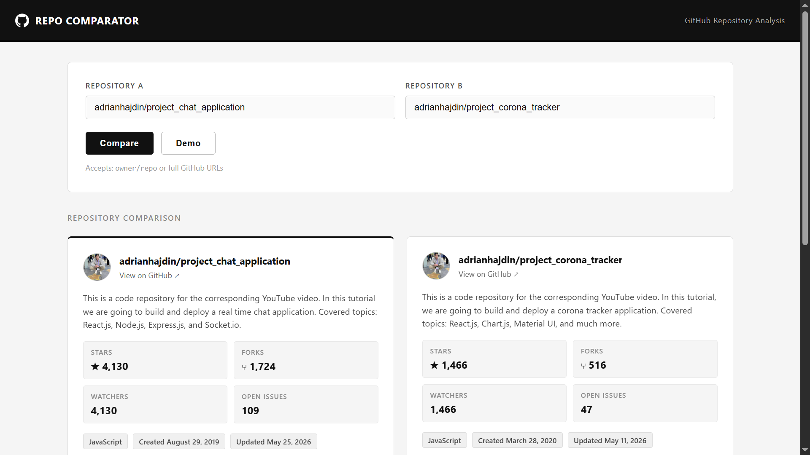

# ANSWERS.md

## 1- How to run

Follow these steps to set up and run the project locally on a fresh machine.

### Prerequisites

- **Node.js** (includes `npm`)
- **Git**
- **A Code Editor** (e.g., VS Code)


### Setup Instructions

### 1. Clone the Repository

Open your terminal (or Git Bash) and run:

```bash
git clone https://github.com/aqibmunir8/Github-Repo-Comparator
cd Github-Repo-Comparator

```

_(Alternatively, download the project as a ZIP file and extract it.)_

### 2. Install Dependencies

```bash
npm install

```

### 3. Start the Development Server

```bash
npm run dev

```

### 4. Access the Application

Once the server starts, open your browser and navigate to:

> 🌐 **[http://localhost:5173](http://localhost:5173/)**


---

### 📸 Preview

#### Dashboard Overview



---

## 2- Stack choices

- **React + Vite** — Vite's dev server starts in under a second and has
  zero-config HMR. <span style="color:#76a6f5"> _(Using Vite with React has become the modern industry standard because it solves the performance bottlenecks of older tools like Create React App (CRA). )_</span>
- **Plain CSS** — The design is intentionally minimal, i intentionally kept plain css for this project.
- **Recharts** — Composable, well-documented, and works naturally with React's
  data model. <span style="color:#76a6f5"> _even Zeeshan bhai did use ReCharts for his goal-slot-web project._</span>
- **Native `fetch`** — The GitHub API is simple enough that Axios adds no real
  value. One less dependency.

---

## 3- One real edge case

#### Edge Case Handling: Network Timeouts via Request Aborting

The code explicitly handles the edge case of extremely slow networks or hung server connections in api.js (lines 4–5 and 27–30) by implementing a strict 10-second request timeout using AbortController. Without this handling, the native browser fetch API would allow the request to remain pending indefinitely or for several minutes on an unstable connection, trapping the application in a perpetual loading state with an unresponsive UI. By intercepting this hang, clearing the timeout, and catching the specific AbortError, the code gracefully breaks the connection after 10 seconds and surfaces a clear, actionable message to the user ("Request timed out. Check your connection and try again") rather than leaving them stranded.

---

## 4- AI usage

Used AI assistance to:

- Draft the initial component structure and CSS layout
- Generate the `normalizeRepoInput` regex logic and edge-case examples
- **Regex Logic**: I asked for a way to parse varying user inputs for GitHub repositories. The AI provided the normalizeRepoInput regex logic along with a list of edge-case examples.
- Write the `markdown` docs
- on few spots to ask and guidance

All generated code was reviewed, trimmed, and adjusted to match the project's
simplicity goals. The architecture decisions were made deliberately, not by the AI.

## Honest gap:

The current limitation is that the chart logic is tightly integrated, and the app relies on a single data source. With another day, I would decouple the charts into isolated, reusable components for a cleaner codebase and integrate additional APIs to gather a wider dataset. While the project is a solid, functional MVP with a strong core concept, adding broader data streams and modular architecture would generate much more useful analysis and elevate it into a truly robust, production-grade application.
