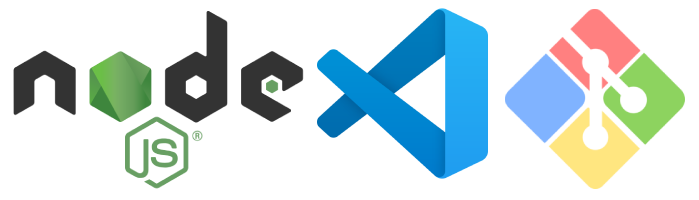

# GitHub Repo Comparator

Compare two GitHub repositories side-by-side. See live stats, metadata, and a
visual bar chart — all pulled directly from the GitHub REST API.

## Project Documentation & Question Answers

Alll required answers regarding project setup, edge case handling, AI usage, and future improvements have been fully detailed in the document below:

📂 **[Read the Answers Here](./ANSWERS.md)**

---

### Prerequisites

To set up and run this project locally, you only need two essential tools:

- **Node.js:** This is required to run the application and includes **npm** (Node Package Manager) to manage project dependencies.
- **A Code Editor:** We recommend **Visual Studio Code (VS Code)**, but any text editor will work.

### Getting the Code

You can get a local copy of the project using one of two methods:

1. **Using Git (Recommended):** Use a terminal like **Git Bash** to clone the repository directly and run commands.
2. **Direct Download:** If you prefer not to use Git, you can download the project as a **ZIP file** directly from the repository and extract it. option and run commands via your standard terminal or CMD.
   <br><br>



## Setup

Here is a quick, clean, and professional rewrite of your setup guide. It keeps the instructions short but adds just enough detail so anyone can follow it without getting stuck.

---

## 🚀 Quick Start Guide

Follow these steps to get the web app running locally on your machine.

### 1. Clone the Repository

Open your terminal (or Git Bash) and run the following commands to clone the project and navigate into its folder:

```bash
git clone https://github.com/aqibmunir8/Github-Repo-Comparator
cd Github-Repo-Comparator

```

### 2. Install Dependencies

Install all the required packages and dependencies

```bash
npm install

```

### 3. Start the Development Server

Launch the project locally. Once running, open the provided local URL (usually `http://localhost:5173`) in your browser:

```bash
npm run dev

```

Here is a clean and polished version of this final step, formatted beautifully for a `README.md` file:

---

### 4. Access the Web App

Once the server is running, open your browser and navigate to:

> 🌐 **[http://localhost:5173](http://localhost:5173/)**


#### Dashboard Overview

This is how the fully loaded WebApp will look and feel as you interact with it:


## TL;DR

```bash
git clone <repository-url>
cd <project-directory-name>
npm install
npm run dev

```

---

<span style="color:#76a6f5">_I know we only needed the setup instructions, but I included these extra sections to provide a complete and comprehensive overview of the project._</span>

## Features

- Compare any two public GitHub repositories
- Live data from the GitHub REST API (no backend, no auth required)
- Side-by-side repository cards showing stars, forks, watchers, open issues,
  language, license, and dates
- Grouped bar chart (Recharts) for visual comparison
- Demo button pre-loads two real repositories
- Clean monochrome UI — black, white, and gray only

---

## Supported Input Formats

All of these resolve to the same repository:

```
facebook/react
https://github.com/facebook/react
https://github.com/facebook/react/
github.com/facebook/react
```

The `normalizeRepoInput()` utility strips protocols, trailing slashes, and
extra path segments, then returns a clean `owner/repo` string.

---

## Error Handling

| Situation                  | Message shown                                      |
| -------------------------- | -------------------------------------------------- |
| Empty input                | "Please enter both repositories before comparing." |
| Malformed input            | Explains the expected format                       |
| Repository not found (404) | `"Repository "owner/repo" not found."`             |
| Rate limit exceeded (403)  | Asks the user to wait a minute                     |
| Request timeout (>10s)     | Suggests checking the connection                   |
| Network failure            | Generic connection error                           |

Raw HTTP status codes and Axios/fetch stack traces are never shown to the user.

---

## Project Structure

```
src/
├── assets/
│   └── LoadingSpinner.svg
├── components/
│   ├── Header.jsx
│   ├── SearchForm.jsx
│   ├── RepoCard.jsx
│   ├── ComparisonChart.jsx
│   ├── ErrorMessage.jsx
│   └── LoadingState.jsx
├── services/
│   └── githubApi.js        ← all fetch logic lives here
├── utils/
│   ├── normalizeRepoInput.js
│   ├── validateRepo.js
│   └── formatDate.js
├── styles/
│   ├── App.css
│   ├── Header.css
│   ├── SearchForm.css
│   ├── RepoCard.css
│   ├── Chart.css
│   └── Loading.css
├── App.jsx                 ← root component, owns all shared state
└── main.jsx                ← React entry point
```

---

## Stack

| Tool            | Why                                            |
| --------------- | ---------------------------------------------- |
| React 18        | UI library                                     |
| Vite            | Fast dev server and build tool                 |
| Recharts        | Simple, composable chart library               |
| Plain CSS       | No build-time overhead, easy to read           |
| GitHub REST API | Public, no auth needed for read-only repo data |
